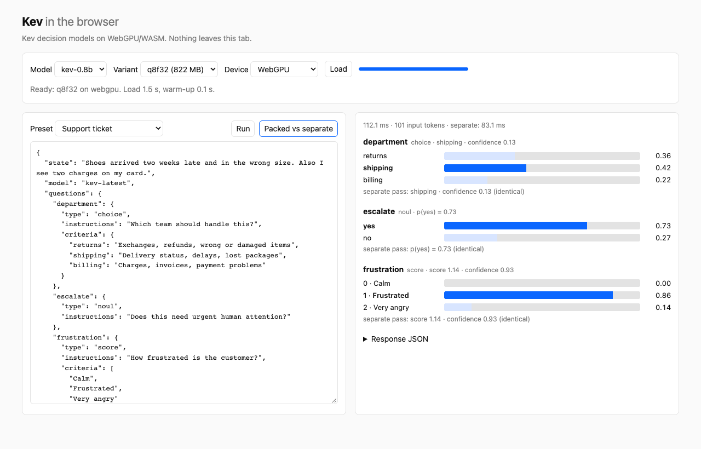

# kev-web

[Kev](https://github.com/jaredpalmer/kev) decision models running in the browser on WebGPU (or WASM), with the same
TypeSafe System One request and response shapes as `kev.serve`. No server: the model, tokenizer and pointer head
run in a Web Worker.



## Results

Both Kev models run in headless Chrome 153 on an Apple M4 Max (WebGPU on Metal).

### Kev-4B

`jaredpalmer/kev-4b`, variant `q8f32`: int8 weights with fp32 activations, a 4.7 GB download in three shards.

| | Browser (WebGPU) | Reference (fp32) |
|---|---|---|
| Accuracy on 300 transfer-v4 dev records | 0.770 | 0.767 |
| Brier score | 0.339 | 0.340 |
| Max / mean \|Δp\| on the 300 records | 0.032 / 0.0024 | – |
| Max \|Δp\| on 29 fixture questions (vs PyTorch) | 0.012, no argmax flips | – |
| 3-question request | 364 ms (267 ms with the state cached) | Kev's PyTorch server: 779 ms on an M5 |

On the README ticket it answers returns 0.47, shipping 0.28, billing 0.25, the same as Kev-4B's published example.
int4 (2.3–2.5 GB) is not usable at 4B either: max \|Δp\| 0.31–0.37 and 3 of 29 argmaxes flipped.

### Kev-0.8B

`jaredpalmer/kev-0.8b`. Reference: the fp32 PyTorch model
(`kev.evaluate.load`). The fp32 ONNX export matches it to 3e-5, so the 300-record comparison uses the fp32 export
as the reference.

| Variant | Download | Weights / activations | Max \|Δp\|, 49 fixture questions | 300 transfer-v4 dev records: accuracy / Brier (reference 0.660 / 0.487) | Argmax flips | Latency, 3-question request |
|---|---|---|---|---|---|---|
| **`q8f32`** (default) | 822 MB | int8 / fp32 | 0.030 | 0.657 / 0.488 | 1 / 300 | 112 ms (83 ms with the state cached) |
| `q8` | 788 MB | int8 / fp16 | 0.040 | 0.663 / 0.488 | 1 / 300 | 116 ms |
| `fp16` | 1.5 GB | fp16 / fp16 | 0.159 | 0.663 / 0.486 | 1 / 300 | 128 ms |
| `q8f32`, WASM (CPU) | 822 MB | int8 / fp32 | 0.030 | 0.657 / 0.488 | 1 / 300 | ≈ 500 ms per record |

For comparison, Kev's own PyTorch server takes 329 ms for Kev-0.8B on an M5 (MPS, no fast DeltaNet kernels). The
largest deviations come from near-ties, for example an MMLU item whose reference top probability is 0.499.

int4 is not usable at 0.8B either. Round-to-nearest, k-quant, block size 16, and int8 for the linear-attention layers all
move probabilities by 0.24–0.78 and flip 1–8 of 49 argmaxes, including with fp16 embeddings. See
`export/build.sh` for the variants that were tried.

## How It Works

Kev is a Qwen3.5 base, a rank-16 LoRA and a small pointer head. The head scores each option's `</opt>` hidden state
against the question's `<decide>` hidden state. Nothing is generated, so one forward pass is the whole job.

Qwen3.5 mixes Gated DeltaNet (recurrent) layers with full attention, so Kev serves hybrid models in rows. The state
runs once, and each question runs as a continuation of the state's cache
(`kev.model._branch_rows_from_prefix`). That maps directly onto an ordinary exported decoder with a KV cache,
with no custom attention mask:

1. **Merge** (`kev_web_export.merge`): fold the LoRA into the base in fp32 (exact), write a
   `Qwen3_5ForConditionalGeneration` checkpoint, the head (`head.safetensors`) and `kev.json`.
2. **Build** (`export/build.sh`): the onnxruntime-genai model builder with `exclude_lm_head=true` outputs
   `hidden_states` after the final norm. It emits `LinearAttention`, `CausalConvWithState`,
   `LinearAttentionGate`, `GatedRMSNorm`, `MRotaryEmbedding` and `GroupQueryAttention`, all of which have WebGPU
   kernels in onnxruntime-web 1.30 (`onnxruntime-web/webgpu`, the native WebGPU EP). 667 of 675 nodes run on
   WebGPU; the other 8 are shape ops.
3. **Post-process** (`kev_web_export.postprocess`): the builder can only quantize embeddings to int4. The
   embedding table (0.5 GB fp16 for 0.8B, 2.5 GB fp32 for 4B) becomes int8 with one scale per row, using plain
   `Gather`/`Cast`/`Mul`. The rotary caches are trimmed from 262k positions to 8,192, which is `kev.serve`'s limit.
   External weights are split into files of at most 1.9 GB, because browsers cap single buffers near 2 GB.
4. **Package** (`kev_web_export.package`): `manifest.json` (I/O names, empty-cache shapes, parity), tokenizer,
   head and one directory per variant.

The runtime (`src/`) is a port of `kev/api.py` and `kev/model.py`. `render`, `to_record`, `to_answers`,
`encode` and the delimiter escaping are reproduced exactly, including Python's `str()` formatting (`True`,
`1e-07`). On WebGPU the state's recurrent, conv and KV caches stay on the GPU (`gpu-buffer`) and are reused by
every question, and by later requests with the same state (LRU of 4, as in `kev.serve`).

## Quick Start

You need Python 3.12 with [uv](https://docs.astral.sh/uv/), Node 20+, and about 20 GB of disk for Kev-0.8B.

```bash
git clone --recursive <this repo> && cd kev-web
cd export && uv sync
uv run python -m kev_web_export.merge --run jaredpalmer/kev-0.8b --out build/kev-0.8b
./build.sh build/kev-0.8b fp32-cpu q8f32-webgpu q8f16-webgpu fp16-webgpu
uv run python -m kev_web_export.postprocess --src build/kev-0.8b/onnx-q8f32-webgpu --out build/kev-0.8b/web-q8f32
uv run python -m kev_web_export.postprocess --src build/kev-0.8b/onnx-q8f16-webgpu --out build/kev-0.8b/web-q8
uv run python -m kev_web_export.postprocess --src build/kev-0.8b/onnx-fp16-webgpu --out build/kev-0.8b/web-fp16 --embed keep
uv run python -m kev_web_export.package --build build/kev-0.8b --out ../dist/models/kev-0.8b \
    --variant q8f32=web-q8f32 --variant q8=web-q8 --variant fp16=web-fp16 --variant fp32=onnx-fp32-cpu \
    --fixtures ../fixtures/kev-0.8b.json
cd .. && npm install && npm run dev      # http://127.0.0.1:5173
```

On macOS the builder can abort with `recursive_mutex lock failed` after it has written everything.
`build.sh` checks for `genai_config.json` instead of relying on the exit code.

Kev-4B uses the same steps with `--run jaredpalmer/kev-4b --out build/kev-4b` and only the `fp32-cpu` and
`q8f32-webgpu` builds, and about 45 GB of disk for the merged checkpoint, the fp32 reference and the int8 build.

### Library

```ts
import * as ort from "onnxruntime-web/webgpu";
import { loadKev } from "kev-web";

const kev = await loadKev("https://example.com/models/kev-0.8b", { ort, variant: "q8f32", executionProviders: ["webgpu"] });
const res = await kev.systemOne({
  state: "I was charged twice. Please fix this ASAP.",
  questions: {
    billing: { type: "noul", instructions: "Is this ticket about billing?" },
    urgency: { type: "score", instructions: "How urgent is this ticket?", criteria: ["can wait", "this week", "today"] },
  },
});
// res.answers.billing.noul, res.answers.urgency.score, res.usage, res.latency_ms
```

`kev.systemOneSeparate()` answers each question in its own pass. `kev.probs(record)` returns raw probabilities.
Weight files are cached in Cache Storage (`kev-web-v1`). In the demo page, `window.kev.systemOne(...)` works from
the console, and `?verbose` logs where onnxruntime placed each node.

## Testing

```bash
npm test                                   # rendering, tokenization and encoding parity; full runtime on onnxruntime-node
KEV_VARIANTS=fp32 npm test                 # just the exact variant
KEV_MODEL=kev-4b npm test                  # fixtures/kev-4b.json against dist/models/kev-4b
cd export && uv run python -m kev_web_export.parity --model build/kev-0.8b/web-q8f32/model.onnx \
    --head build/kev-0.8b/head.safetensors --fixtures ../fixtures/kev-0.8b.json
```

- `fixtures/kev-0.8b.json`: 43 records (3 hand-written, including structured state and delimiter injection, plus
  40 from transfer-v4 dev) with the rendered record, Kev's token encoding and the PyTorch probabilities.
  Regenerate with `kev_web_export.fixtures`.
- `fixtures/kev-4b.json`: the same 3 hand-written records plus 20 dev records, for Kev-4B.
- `fixtures/kev-*-transfer-v4-dev300.json`: 300 labelled records with fp32 reference probabilities
  (`kev_web_export.evalset`), used for the browser accuracy and Brier comparisons above.

## Limitations

- JSON parsing loses two things Kev's Python server keeps. `1.0` arrives as `1` and is rendered `1`, where Python
  renders `1.0`. Object keys that look like integers (`"10"`, `"2"`) are iterated in numeric order, which can
  reorder Choice options with numeric names.
- The first load downloads 822 MB for Kev-0.8B, or 4.7 GB for Kev-4B, and the files stay in Cache Storage.
  Kev-4B needs a GPU with enough memory for about 4.5 GB of weights. Only Chrome was tested; Safari and Firefox
  WebGPU are untested.
- Kev-9B is not packaged. At int8 it would be about 10 GB.
- onnxruntime-node 1.30 on Node 24+ reads 0 bytes from `Float16Array` float16 tensors, so the tests hide
  `Float16Array` (`test/no-float16.ts`). Browsers are not affected.
- Requests run one at a time per model instance.

## License

Apache-2.0, like Kev and the Qwen3.5 weights. Kev itself is vendored as a pinned submodule (`vendor/kev`).
